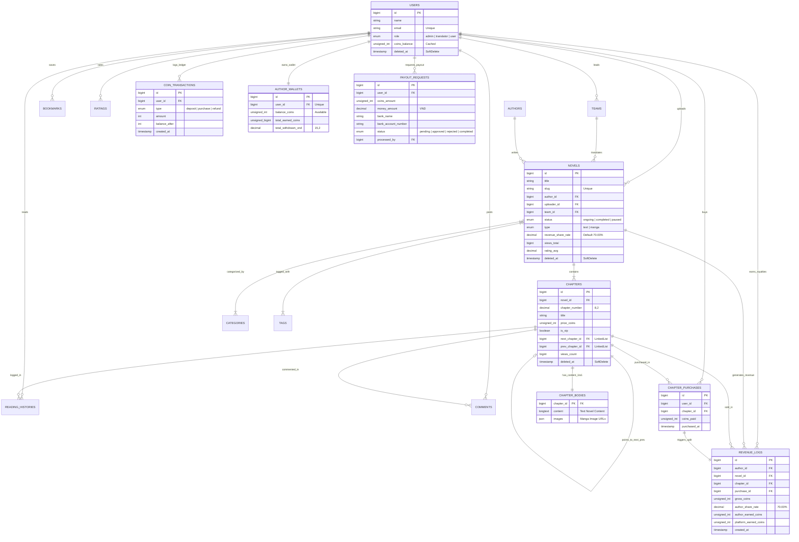

# 🗄️ Database Documentation & Complete Schema (`DATABASE-v3.md`)

Tài liệu thiết kế Cơ sở dữ liệu (Database Schema) toàn diện **phiên bản v3 (Commercial & Production-Ready)** cho dự án **Web Đọc Truyện (Novel & Manga Platform)** với **Laravel 13** & **FilamentPHP**.

---

## 🛠️ Các Cải Tiến Cốt Lõi Trên Phiên Bản v3

Phiên bản **v3** bổ sung phân hệ **Thương mại hóa & Chia sẻ Doanh thu Tác giả (Author Revenue & Payout System)**, giúp website vận hành như một nền tảng truyện sáng tác / dịch thuật chuyên nghiệp:

1. **Phân Hệ Doanh Thu Tác Giả & Nhóm Dịch (`revenue_logs`, `author_wallets`)**:
   - Thêm cột `revenue_share_rate` (tỷ lệ ăn chia % mặc định 70%) vào từng bộ truyện trong bảng `novels`.
   - Mỗi khi độc giả mua chương VIP bằng xu, hệ thống tự động ghi nhật ký `revenue_logs` chia tiền giữa Tác giả/Dịch giả và Nền tảng (Platform Fee).
   - Quản lý ví thu nhập `author_wallets` cho phép tích lũy và theo dõi tổng doanh thu khả dụng.

2. **Hệ Thống Yêu Cầu Rút Tiền (`payout_requests`)**:
   - Cho phép Tác giả gửi yêu cầu rút tiền về tài khoản ngân hàng.
   - Admin duyệt và xử lý chuyển khoản trực tiếp trên Filament Admin Panel.

3. **Bảo Tồn Toàn Bộ Tối Ưu CSDL v2**:
   - Tách bảng dữ liệu nặng `chapter_bodies` (`LONGTEXT` / `JSON`) khỏi `chapters` Metadata.
   - Con trỏ chuyển chương $O(1)$ (`next_chapter_id`, `prev_chapter_id`).
   - Sổ cái tài chính `coin_transactions` chống Race Condition.
   - An toàn dữ liệu với `SoftDeletes` (`deleted_at`).

---

## 📊 1. Sơ Đồ Thực Thể Liên Kết Cập Nhật (Mermaid ERD v3)



---

## 📋 2. Chi Tiết Cấu Trúc Các Bảng 

### 2.1. Group: Người Dùng, Ví Thu Nhập & Sổ Cái (`users`, `author_wallets`, `coin_transactions`, `payout_requests`)

#### Bảng `users`
| Tên Cột | Kiểu Dữ Liệu | Thuộc Tính | Mô Tả |
| :--- | :--- | :--- | :--- |
| `id` | `BIGINT` | `UNSIGNED, AUTO_INCREMENT, PK` | Mã người dùng |
| `name` | `VARCHAR(255)` | `NOT NULL` | Tên hiển thị |
| `email` | `VARCHAR(255)` | `NOT NULL, UNIQUE` | Email đăng nhập |
| `password` | `VARCHAR(255)` | `NOT NULL` | Mật khẩu mã hóa |
| `role` | `ENUM` | `'admin', 'translator', 'user'` | Vai trò trong hệ thống |
| `coins_balance` | `INT` | `UNSIGNED, NOT NULL, DEFAULT 0` | Số dư xu cached độc giả dùng đọc truyện |
| `deleted_at` | `TIMESTAMP` | `NULLABLE` | Soft Delete |

#### Bảng `author_wallets` *(Mới - Ví thu nhập Tác giả / Dịch giả)*
| Tên Cột | Kiểu Dữ Liệu | Thuộc Tính | Mô Tả |
| :--- | :--- | :--- | :--- |
| `id` | `BIGINT` | `UNSIGNED, AUTO_INCREMENT, PK` | Mã ví |
| `user_id` | `BIGINT` | `UNSIGNED, UNIQUE, FK -> users.id` | Mã Tác giả / Dịch giả sở hữu |
| `balance_coins` | `INT` | `UNSIGNED, NOT NULL, DEFAULT 0` | Số xu khả dụng có thể gửi yêu cầu rút tiền |
| `total_earned_coins` | `BIGINT` | `UNSIGNED, NOT NULL, DEFAULT 0` | Tổng xu tích lũy đã kiếm được |
| `total_withdrawn_vnd`| `DECIMAL(15,2)`| `NOT NULL, DEFAULT 0.00` | Tổng tiền VNĐ đã rút thành công |
| `updated_at` | `TIMESTAMP` | `NULLABLE` | Thời điểm cập nhật số dư gần nhất |

#### Bảng `payout_requests` *(Mới - Yêu cầu rút tiền)*
| Tên Cột | Kiểu Dữ Liệu | Thuộc Tính | Mô Tả |
| :--- | :--- | :--- | :--- |
| `id` | `BIGINT` | `UNSIGNED, AUTO_INCREMENT, PK` | Mã yêu cầu rút tiền |
| `user_id` | `BIGINT` | `UNSIGNED, FK -> users.id` | Tác giả gửi yêu cầu |
| `coins_amount` | `INT` | `UNSIGNED, NOT NULL` | Số xu yêu cầu quy đổi |
| `exchange_rate` | `INT` | `UNSIGNED, NOT NULL, DEFAULT 1000`| Quy đổi (VD: 1 xu = 1,000 VNĐ) |
| `money_amount` | `DECIMAL(15,2)`| `NOT NULL` | Số tiền VNĐ thực nhận |
| `bank_name` | `VARCHAR(100)` | `NOT NULL` | Tên ngân hàng nhận |
| `bank_account_number`| `VARCHAR(50)`| `NOT NULL` | Số tài khoản ngân hàng |
| `bank_account_holder`| `VARCHAR(100)`| `NOT NULL` | Tên chủ tài khoản |
| `status` | `ENUM` | `'pending', 'approved', 'rejected', 'completed'` | Trạng thái xử lý |
| `admin_note` | `TEXT` | `NULLABLE` | Ghi chú của Admin (Lý do từ chối, mã GD) |
| `processed_by` | `BIGINT` | `UNSIGNED, NULLABLE, FK -> users.id` | Admin duyệt lệnh |
| `processed_at` | `TIMESTAMP` | `NULLABLE` | Thời điểm duyệt |

---

### 2.2. Group: Nội Dung Truyện Core (`novels`, `chapters`, `chapter_bodies`)

#### Bảng `novels` *(Bổ sung tỷ lệ chia sẻ doanh thu)*
| Tên Cột | Kiểu Dữ Liệu | Thuộc Tính | Mô Tả |
| :--- | :--- | :--- | :--- |
| `id` | `BIGINT` | `UNSIGNED, AUTO_INCREMENT, PK` | Mã bộ truyện |
| `title` | `VARCHAR(255)` | `NOT NULL` | Tiêu đề bộ truyện |
| `slug` | `VARCHAR(255)` | `NOT NULL, UNIQUE` | Slug URL |
| `author_id` | `BIGINT` | `UNSIGNED, FK -> authors.id` | Tác giả |
| `uploader_id` | `BIGINT` | `UNSIGNED, FK -> users.id` | Người đăng |
| `team_id` | `BIGINT` | `UNSIGNED, FK -> teams.id` | Nhóm dịch |
| `status` | `ENUM` | `'ongoing', 'completed', 'paused'` | Trạng thái ra chương |
| `type` | `ENUM` | `'text', 'manga'` | Loại truyện |
| `revenue_share_rate`| `DECIMAL(5,2)`| `NOT NULL, DEFAULT 70.00` | Tỷ lệ % doanh thu cho tác giả (70.00%) |
| `views_total` | `BIGINT` | `UNSIGNED, DEFAULT 0` | Tổng lượt xem |
| `rating_avg` | `DECIMAL(3,2)`| `UNSIGNED, DEFAULT 0.00` | Điểm đánh giá TB |
| `deleted_at` | `TIMESTAMP` | `NULLABLE` | Soft Delete |

#### Bảng `chapters`
| Tên Cột | Kiểu Dữ Liệu | Thuộc Tính | Mô Tả |
| :--- | :--- | :--- | :--- |
| `id` | `BIGINT` | `UNSIGNED, AUTO_INCREMENT, PK` | Mã chương |
| `novel_id` | `BIGINT` | `UNSIGNED, FK -> novels.id` | Bộ truyện thuộc về |
| `chapter_number` | `DECIMAL(8,2)`| `UNSIGNED, NOT NULL` | Số chương (10, 10.5, 100) |
| `title` | `VARCHAR(255)` | `NULLABLE` | Tiêu đề chương |
| `price_coins` | `INT` | `UNSIGNED, DEFAULT 0` | Giá mở khóa (0 = Miễn phí) |
| `is_vip` | `BOOLEAN` | `DEFAULT false` | Đánh dấu chương VIP |
| `next_chapter_id`| `BIGINT` | `UNSIGNED, NULLABLE, FK -> chapters.id` | Con trỏ chương tiếp ($O(1)$) |
| `prev_chapter_id`| `BIGINT` | `UNSIGNED, NULLABLE, FK -> chapters.id` | Con trỏ chương trước ($O(1)$) |
| `views_count` | `BIGINT` | `UNSIGNED, DEFAULT 0` | Lượt xem đệm |

#### Bảng `chapter_bodies`
| Tên Cột | Kiểu Dữ Liệu | Thuộc Tính | Mô Tả |
| :--- | :--- | :--- | :--- |
| `chapter_id` | `BIGINT` | `UNSIGNED, PRIMARY KEY, FK -> chapters.id` | Mã chương liên kết (1-to-1) |
| `content` | `LONGTEXT` | `NULLABLE` | Văn bản chương (Truyện chữ) |
| `images` | `JSON` | `NULLABLE` | Danh sách URL ảnh (Manga) |

---

### 2.3. Group: Doanh Thu & Nhật Ký Ăn Chia (`revenue_logs`, `chapter_purchases`)

#### Bảng `revenue_logs` *(Mới - Nhật ký chia tiền)*
| Tên Cột | Kiểu Dữ Liệu | Thuộc Tính | Mô Tả |
| :--- | :--- | :--- | :--- |
| `id` | `BIGINT` | `UNSIGNED, AUTO_INCREMENT, PK` | Mã nhật ký |
| `author_id` | `BIGINT` | `UNSIGNED, FK -> users.id` | Tác giả nhận doanh thu |
| `novel_id` | `BIGINT` | `UNSIGNED, FK -> novels.id` | Bộ truyện |
| `chapter_id` | `BIGINT` | `UNSIGNED, FK -> chapters.id` | Chương được mua |
| `purchase_id` | `BIGINT` | `UNSIGNED, FK -> chapter_purchases.id` | Giao dịch mua chương tương ứng |
| `gross_coins` | `INT` | `UNSIGNED, NOT NULL` | Tổng số xu bán chương (VD: 10 xu) |
| `author_share_rate`| `DECIMAL(5,2)`| `NOT NULL` | Tỷ lệ % tác giả nhận tại thời điểm bán (70.00%) |
| `author_earned_coins`| `INT` | `UNSIGNED, NOT NULL` | Số xu thực nhận của tác giả (VD: 7 xu) |
| `platform_earned_coins`| `INT`| `UNSIGNED, NOT NULL` | Số xu nền tảng giữ lại (VD: 3 xu) |
| `created_at` | `TIMESTAMP` | `NOT NULL` | Thời điểm phát sinh giao dịch |

---

## ⚡ 3. Các Chỉ Mục (Indexes) & Kỹ Thuật Tối Ưu Tải Cao

```sql
-- 1. Index hỗ trợ thống kê doanh thu tác giả nhanh chóng
ALTER TABLE revenue_logs ADD INDEX idx_author_created (author_id, created_at);

-- 2. Index hỗ trợ duyệt yêu cầu rút tiền theo trạng thái
ALTER TABLE payout_requests ADD INDEX idx_status_created (status, created_at);

-- 3. Index hỗ trợ chuyển chương siêu tốc O(1)
ALTER TABLE chapters ADD INDEX idx_next_prev (next_chapter_id, prev_chapter_id);

-- 4. Index hỗ trợ Bảng xếp hạng Top Đọc Nhiều
ALTER TABLE novels ADD INDEX idx_views_rank (views_total DESC, is_hot);
```

---

## 🔗 4. Bảng Ánh Xạ Model Laravel Eloquent Cập Nhật

```php
// User.php
public function authorWallet(): HasOne {
    return $this->hasOne(AuthorWallet::class);
}

public function payoutRequests(): HasMany {
    return $this->hasMany(PayoutRequest::class);
}

public function revenueLogs(): HasMany {
    return $this->hasMany(RevenueLog::class, 'author_id');
}

// ChapterPurchase.php
public function revenueLog(): HasOne {
    return $this->hasOne(RevenueLog::class, 'purchase_id');
}
```
